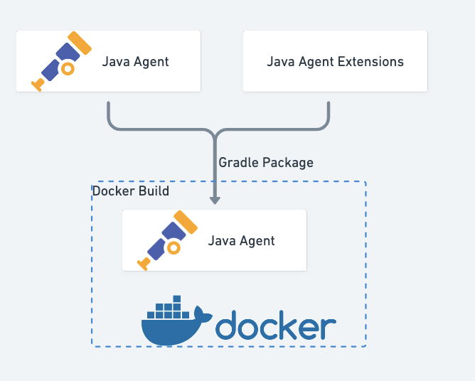

# OpenTelemetry Java Instrumentation Extensions

Embed extensions in the [OpenTelemetry Java Agent](https://github.com/open-telemetry/opentelemetry-java-instrumentation), produces a copy of upstream javaagent with this extension jar included inside it.

More about otel java instrumentation extension mechanism, please following the [official docs](https://github.com/open-telemetry/opentelemetry-java-instrumentation/blob/main/examples/extension/README.md)
